# Projet : Bot Discord

Pour conclure ce module de Backend Javascript, nous allons voir une partie un peu différente de ce que l’on a vu au début, mais tout en restant sur l’utilisation de Node.js, et des principes que nous avons exploré auparavant.

Par équipe de 5 maximum, vous allez devoir concevoir un petit bot pour Discord, qui pourra permettre aux utilisateurs d’exécuter plusieurs fonctionnalités. 

## 1. Introduction

### 1.1 Objectifs

Via la création d’un bot pour le logiciel de discussion Discord, nous allons pouvoir mettre en pratique plusieurs choses :
    • L’utilisation de packages existant sur npm (pour ne pas réinventer la roue)
    • Voir comment fonctionne un back-end ayant une haute interaction avec les utilisateurs
    • Mettre notre créativité au défi pour concevoir des petites fonctionnalités sympa sur le bot
    
### 1.2 La notation

La notation se fera sur 100 points. Chaque partie possède une note qui sera précisée à côté du titre. 

Le fonctionnement global de votre bot est noté sur **80**, les **20** points restants se jouent sur la qualité du code (organisaiton, lisibilité, propreté). 
La note sera ramené sur 20 par la suite. 

## 2. Les fonctionnalités de base *(15 points)*

Imaginons que vous vouliez utiliser votre bot à des fins de modérations, relativement basiques, permettant de kicker un utilisateur du serveur, de bannir un utilisateur, de timeout quelqu’un pour qu’il ne puisse pas parler, ect. Nous allons dans un premier temps implémenter ces commandes.

Notez que pour chaque commande, s'il se passe une erreur lors de l'exécution, le bot devra informer l'utilisateur qui a déclenché la commande qu'il y a eu un problème. Vous devez donc penser à une **gestion des erreurs**.

### 2.1 Définir un préfixe *(1pt)*

Avant de commencer quoi que ce soit, nous aurons besoin de définir un **préfixe** qui nous permettra de différencier les messages normaux envoyés dans les channels, des messages contenant des commandes devant être interceptés par le bot.

Pour la suite de cet énnoncé, nous allons utiliser le préfixe **#**. 

### 2.2 La commande clear *(2pts)*

L’objectif est de vider un channel discord d’un certain nombre de messages.

L'utilisation de la commande devra ressembler à ceci :

```
#clear <nbMessages>
```

Faites attention toutefois, Discord ne nous autorise à supprimer que seulement 100 messages à la fois.

Le bot peut renvoyer une réponse, ou pas, c'est à vous de choisir. 

### 2.3 La commande kick *(3pts)*

Avec cette commande, nous allons pouvoir virer un utilisateur du serveur. Ce dernier pourra néanmoins toujours le rejoindre. 

La commande devra ressembler à ceci :

```
#kick @user <raison>
```

La raison au kick peut-être optionnelle. 

Le bot devra nous renvoyer une réponse, comme sur l'exemple ci-dessous : 

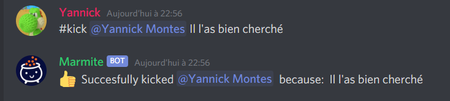

### 2.4 La commande ban & unban *(5pts)*

Très similaire à la commande kick, elle permet de bannir un utilisateur du serveur, mais cette fois-ci sans autoriser la personne virée de le rejoindre à nouveau.

La commande devra ressembler à ceci :

```
#ban @user <raison>
```

La raison au ban peut-être optionnelle. 

Le bot devra nous renvoyer une réponse, comme sur l'exemple ci-dessous : 

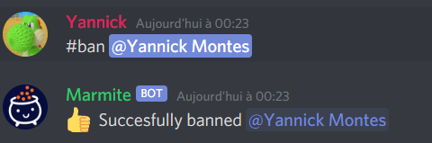

Nous voulez pouvoir dé-bannir un utilisateur, via la commande **unban**. Un exemple suit ci-desous:
```
#unban @user
```

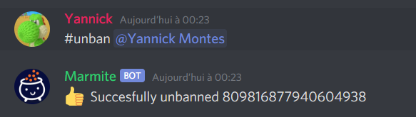

### 2.5 Les commandes mute & unmute *(5pts)*

Via cette commande, nous allons essayer d'empêcher un utilisateur de pouvoir parler sur le serveur pour un temps donné.

Pour vous donner quelques pistes, nous allons utiliser les rôles pour ceci. L'objectif va être de créer un role ***"Mute"***, qui possèdera uniquement les droits de lecture, ainsi qu'un rôle "Membre", qui possèdera lui tout les droits qu'un utilisteur du serveur est censé avoir. 

Vous devrez également désactiver tout les droits du rôle de base @everyone, autrement le timeout ne fonctionnera pas.


Lorsque l'on timeout un utilisateur, l'objectif est de lui retirer le rôle "Membre", et de lui assigner le rôle ***"Mute"*** pour un temps donné. 

Une fois ce temps écoulé, l'utilisateur récupère le rôle "Membre". La commande **unmute** permet également d'oublier ce timer, et de permettre directement à l'utilisateur de reparler à nouveau.

La suite d'image montre l'utilisation de la commande, ainsi que de son inverse **unmute**. Le bot devra répondre lorsque on déclenche la commande mute.

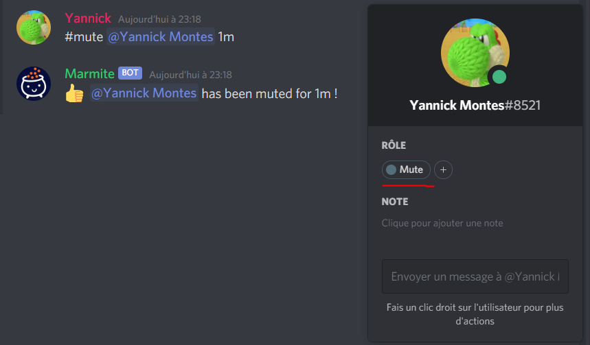

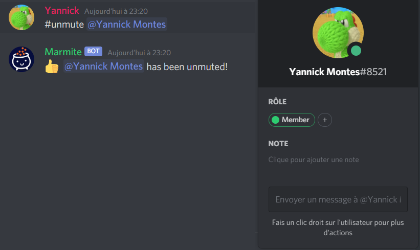

*Hint: Vous pouvez utiliser le package **"ms"** de npm, pour pouvoir interpréter les durées de temps sous forme de "1m", "10s", ect.

## 3. Gérer l'acceuil et les réactions *(7 points)*

### 3.1 Traitement lors d'un nouvel arrivant *(3 pts)*

Comme nous avons virer tout les droits pour le rôle ```@everyone```, chaque personne qui va rejoindre le serveur va se retrouver sans droits ni rien. Il faut donc assigner à chaque personne qui arrive le rôle de "Membre", et potentiellement lui envoyer un petit message d'accueil dans un channel ```#bienvenue```.

Pour cela, vous pourrez utiliser la fonction ```client.on('guildMemberAdd', guildMember => {})``` de Discord.js.

### 3.2 Assigner des rôles selon les réactions *(5 pts)*

Par soucis de facilité sur les gros serveur discord, chaque utilisateur décide de s'assigner les rôles qu'il veut sur le serveur. 
Généralement, ces rôles permettent d'accéder à certains channels (textuels ou vocaux) du serveur. Sans ce rôle, impossible d'y accéder. 

Voici un exemple ci-dessous: 

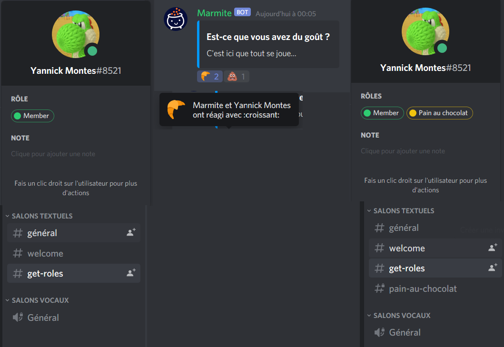

## 4. Créer un sondage via la commande Poll *(8 points)*

Inspiré du bot Simple poll (que vous pouvez voir [ici](https://top.gg/bot/simplepoll)), nous allons créer une commande permettant de créer un sondage. 

Les paramètres de la commande sont:
- La question du sondage
- Autant d'options qu'on veut ...(bon pas tout à fait, on va mettre la limite a 26, le nombre de lettres de l'alphabet, vous allez voir pourquoi)

Voici un exemple d'utilisation :

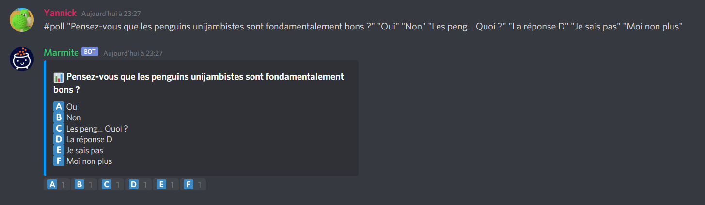

*Hint: Pensez à regarder la doc de Discord.js, qui permet de créer pleins de messages bien formatté, comme les MessageEmbed par exemple.*

## 5. Jouer de la musique dans un salon vocal *(20 points)*

Pour s'ambiancer jusqu'a pas d'heures pendant les sessions de ~~gaming~~ cours, rien ne vaut un petit peu de musique.

Vous allez devoir implémenter la possibilité de jouer une musique dans un channel vocal, joué par votre bot.

Rassurez-vous, il existe déjà beaucoup de choses permettant de nous faciliter la tâche. 

Le bot communiquera directement avec Youtube pour récupérer la musique qu'on lui demande. Chaque utilisateur pouvant envoyer des commandes au bot pourra lancer une nouvelle musique (qui s'ajoutera à la file d'attente), passer la musique en cours, ou décider d'arrêter complètement le bot de musique.

Lorsqu'une musique est terminée, le bot regarde s'il lui reste des musiques dans sa file d'attente. Si oui, il passe a la suivante, si non, il quitte le salon vocal.

Toute commande venant d'un utilisateur qui ne se situe pas dans un channel vocal ne sera pas acceptée.

### 5.1 La commande play *(8)*

Pour commencer, nous allons demander au bot de jouer une musique. La commande prendra en paramètre, soit une URL youtube directement, soit une phrase, qui sera recherchée directement sur Youtube. Le bot devra prendre le premier résultat trouvé, par facilité.

Pour cette partie, vous allez devoir utiliser les packages **ytdl-core** et **yt-search** qui permettront de se passer de tout les traitements de discussion avec l'API de Youtube.

Un exemple de l'utilisation de la commande est visible ci-dessous :

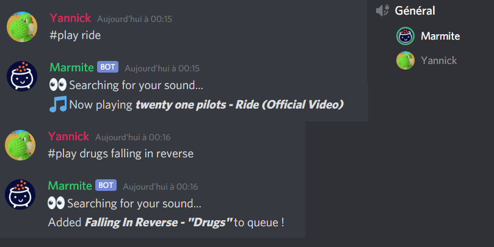


### 5.2 La commande stop *(8)*

Cette commande aura pour conséquence d'arrêter la musique en cours, et de faire quitter le channel vocal au bot.

Un exemple d'utilisation: 

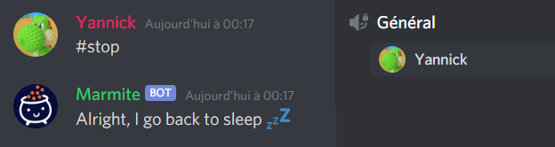

### 5.3 La commande skip *(4)*

Cette commande permettra de passer a la chanson suivante. S'il n'y en a pas, le bot quittera le channel vocal.

Un exemple d'utilisation: 


### 6 Les triggers *(30 points)*

Toujours dans le but de passer le moment le plus exceptionnel qu'il soit sur notre serveur, on aimerait bien que notre bot possède des triggers.

L'idée, c'est que le bot réagisse à certaines phrases, rentrées au préalable par l'utilisateur, par une autre phrase, une image, un gif...

Pour cela, nous allons devoir créer une base de données qui stockera chaque trigger que le bot possède. 

Vous êtes libre de choisir le type de base de données que vous voulez, je vous conseille de vous orienter vers MongoDB, pour rester dans la continuité de ce que l'on a vu en cours. 

Chaque commande devra permettre à l'utilisateur de savoir si elle a bien fonctionné, ou non.

Pour vous faciliter la tâche, je vous conseille de partir du principe que chaque paramètre qui sera passé à la commande sera entre ```{}```

### 6.1 Ajouter un trigger *(12)*

L'utilisateur du bot devra être capable d'ajouter un trigger a la base de données. 

La seule contrainte pour créer un trigger est de vérifier que ce dernier n'existe pas déjà dans la base de données (par exemple, je ne peux pas voir 2 triggers pour la phrase "je mange des chocolatines"). 

Voici un exemple ci-dessous: 

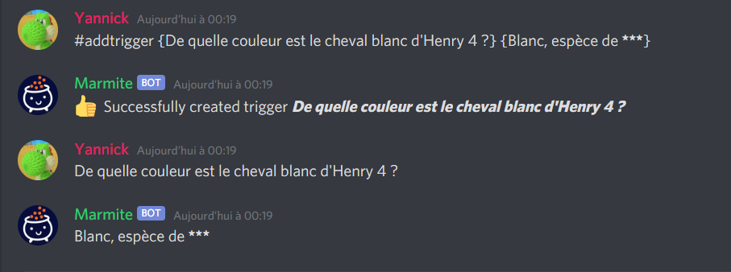

### 6.2 Supprimer un trigger *(12)*

Une commande pour supprimer un trigger sera disponible. Elle prendra en paramètre la triggerPhrase du trigger. 

Voici un exemple ci-dessous: 

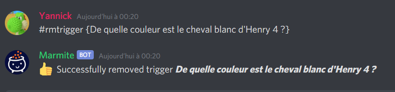

### 6.3 Inspecter tout les triggers *(6)*

Pour pouvoir savoir quels triggers existent sur le serveur, une commande ```triggerlist``` sera disponible. 

Elle retournera la liste des triggers existants, sans le contenu qu'elle trigger (qui pourrait ne pas tenir en 1 message).

Voici un exemple ci-dessous: 

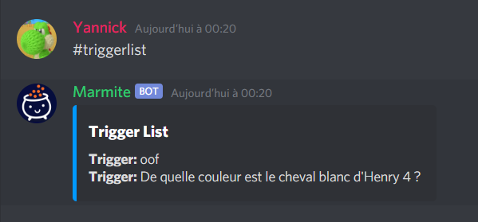

### 6.4 Bonus: inspect & modify

Par soucis de facilité, on aimerait bien pouvoir avoir le contenu d'un seul trigger en utilisant la commande ```inspect```. Elle nous renverrai le contenu que est trigger lorsque le trigger est envoyé dans le chat. 


De la même manière, pour éviter de supprimer et recréer un trigger, on aimerait pouvoir le modifier. Pour cela, une commande ```modifytrigger```, prenant en paramètre le nom du trigger, puis un JSON de modification (par exemple) serait le bienvenu. 

### 7 Songlink/Odesli: utilisation d'une API externe

Si vous ne connaissez pas Songlink, c'est une API qui permet d'obtenir les liens d'une musique sur toutes les plateforme, depuis une spécifique.

Par exemple, si vous prenez la musique Ride - Twenty One Pilots sur youtube, le lien est le suivant: https://www.youtube.com/watch?v=Pw-0pbY9JeU

Si vous souhaitez obtenir tout les liens pour toutes les plateformes, ouvrez votre navigateur, et taper dans votre URL song.link/https://www.youtube.com/watch?v=Pw-0pbY9JeU

Vous arriverez sur une page avec toutes les plateformes.


L'objectif est de pouvoir avoir cette page directement sur discord, envoyé par le bot, lorsqu'on lui donne un lien spotify/youtube/discord... 

Pour ce faire, vous pouvez vous aider de la documentation [ici](https://www.notion.so/API-d0ebe08a5e304a55928405eb682f6741).

### 8 Quelquechose de créatif ?

A vous de m'épater en créant une commande un peu fun ! Cela peut être n'importe quoi.

Si vous n'avez vraiment pas d'idées, n'hésitez pas à regarder ce qui se fait déjà, et essayer de re-coder le comportement.

Sinon, j'ai quelques idées ci-dessous: 
- Une commande pour récupérer les sujets actuellement en tendance France (ou Monde) sur Twitter, voir même les plus gros tweet en question sur un # précis
- Une commande qui permet de récupérer la vidéo de HugoDecrypte la plus récente pour les actus du jour (pour ceux qui ne connaissent pas, c'est [ici](https://www.youtube.com/c/HugoD%C3%A9crypte/videos)
- Une commande pour bouger toutes les personnes d'un channel vocal vers un autre
- Une commande pour savoir si c'est l'heure de l'apéro (grandement inspiré de [ça](https://estcequecestbientotlapero.fr/)....) *(+20 points)*
- Et que sais-je encore !


Happy Hacking !
