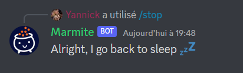

# Projet : Bot Discord

Pour conclure ce module de Backend Javascript, nous allons voir une partie un peu différente de ce que l’on a vu au début, mais tout en restant sur l’utilisation de Node.js, et des principes que nous avons exploré auparavant.

Par équipe de 3-4 maximum, vous allez devoir concevoir un petit bot pour Discord, qui pourra permettre aux utilisateurs d’exécuter plusieurs fonctionnalités.

## 1. Introduction

### 1.1 Objectifs

Via la création d’un bot pour le logiciel de discussion Discord, nous allons pouvoir mettre en pratique plusieurs choses :
• L’utilisation de packages existant sur npm (pour ne pas réinventer la roue)
• Voir comment s'architecture un projet avec TypeScript
• Voir comment fonctionne un back-end ayant une haute interaction avec les utilisateurs
• Mettre notre créativité au défi pour concevoir des petites fonctionnalités sympa sur le bot

### 1.2 La notation

La notation se fera sur 100 points. Chaque partie possède une note qui sera précisée à côté du titre.

Le fonctionnement global de votre bot est noté sur **70**, les **30** points restants se jouent sur la qualité du code (organisaiton, lisibilité, propreté).
La note sera ramené sur 20 par la suite.

## 2. Les fonctionnalités de base _(15 points)_

Imaginons que vous vouliez utiliser votre bot à des fins de modérations, relativement basiques, permettant de kicker un utilisateur du serveur, de bannir un utilisateur, de timeout quelqu’un pour qu’il ne puisse pas parler, ect. Nous allons dans un premier temps implémenter ces commandes.

L'idée de cette partie d'introduction est de se familariser avec le bot, car en réalité, depuis peu, Discord a intégré ces commandes de bases aux slash commandes disponibles.

Notez que pour chaque commande, s'il se passe une erreur lors de l'exécution, le bot devra informer l'utilisateur qui a déclenché la commande qu'il y a eu un problème. Vous devez donc penser à une **gestion des erreurs**.

### 2.1 La commande clear _(2pts)_

L’objectif est de vider un channel discord d’un certain nombre de messages.

L'utilisation de la commande devra ressembler à ceci :

```
/clear <nbMessages> <silent>
```

Paramètres:

- **nbMessages**, stipulant combien de messages le bot doit supprimer
- **silent**, permetant de rendre la commande discrète: si il est à _true_, le message de confirmation sera envoyé seulement a l'utilisateur qui a lancé la commande. S'il est à _false_, alors le bot émettera le message de résultat sur le channel, visible de tout le monde.

Faites attention toutefois, Discord ne nous autorise pas à supprimer les messages datant de plus de **14 jours**, et vous ne pouvez pas en supprimer plus de **100** non plus.


### 2.3 La commande kick _(3pts)_

Avec cette commande, nous allons pouvoir virer un utilisateur du serveur. Ce dernier pourra néanmoins toujours le rejoindre.

La commande devra ressembler à ceci :

```
/kick @user <raison>
```

Paramètres:

- **user**, pour l'utilisateur visé
- **reason**, pour la raison (optionnelle)

Le bot devra nous renvoyer une réponse, comme sur l'exemple ci-dessous :


### 2.4 La commande ban & unban _(5pts)_

Très similaire à la commande kick, elle permet de bannir un utilisateur du serveur, mais cette fois-ci sans autoriser la personne virée de le rejoindre à nouveau.

La commande devra ressembler à ceci :

```
/ban @user <raison>
```

Paramètres:

- **user**, pour l'utilisateur visé
- **reason**, pour la raison (optionnelle)

Le bot devra nous renvoyer une réponse, comme sur l'exemple ci-dessous :


Nous voulez pouvoir dé-bannir un utilisateur, via la commande **unban**. Un exemple suit ci-desous:

```
/unban @user
```

Paramètres:

- **user**, pour l'utilisateur visé

Vous pouvez mettre le retour de cette commande seulement pour la personne qui l'as envoyé.

### 2.5 Les commandes mute & unmute _(5pts)_

Via cette commande, nous allons essayer d'empêcher un utilisateur de pouvoir parler sur le serveur pour un temps donné.

```
/mute @user <timer> <reason>
```

Paramètres:

- **user**, pour l'utilisateur visé
- **reason**, pour la raison (optionnelle)


\*Hint: Vous pouvez utiliser le package **"ms"** de npm, pour pouvoir interpréter les durées de temps sous forme de "1m", "10s", ect.

## 3. Gérer l'acceuil et les réactions _(7 points)_

### 3.1 Traitement lors d'un nouvel arrivant _(3 pts)_

Lorsque vous arrivez sur un nouveau serveur, très généralement vous n'avez pas accès à tout les channels de base, sans vous donner des rôles, ou sans que quelqu'un ne vous approuve (selon la politique du serveur).
Ici, nous allons imaginer un scénario ou le bot nous assigne un rôle spécifique dès notre arrivée sur le serveur, et l enverra un message d'accueil dans le channel `#bienvenue`.

Pour cela, vous pourrez utiliser l'évènement **GuildMemberAdd** de Discord.js.

### 3.2 Assigner des rôles selon les réactions _(5 pts)_

Par soucis de facilité sur les gros serveur discord, chaque utilisateur décide de s'assigner les rôles qu'il veut sur le serveur.
Généralement, ces rôles permettent d'accéder à certains channels (textuels ou vocaux) du serveur. Sans ce rôle, impossible d'y accéder.

Nous allons créer une commande permettant de créer un post sur lequel chaque utilisateur pourra réagir, et le bot écoutera les réactions pour assigner des rôles aux utilisateurs ayant réagi.

La commande aura la forme suivante:

```
/reactionrole
```

Lorsqu'un utilisteur réagit, nous voulons ajouter le rôle correspondant a l'émoji avec lequel il a réagit à l'utilisateur.
De même, lorsqu'il enlève sa réaction, on veut lui enlever le rôle.

### 3.3 Gérer les évènements impromptus _(X points)_

Une fois votre serveur hébergé quelque-part, il peut arriver qu'il soit redémarré, pour X ou Y raisons. Il peut même être redémarré de votre propre fait, suite à une mise à jour par exemple.

La problématique que nous allons avoir lors de ces redémarages est la suivante: le serveur ne va plus écouter le message de reactions que nous avons créé.

Pour pallier à ce problème, nous allons créer un channel sur lequel seulement notre bot aura le droit d'écriture pour les messages.

Lors du démarage de votre bot, vous allez vérifier si un message est présent dans ce channel. S'il l'est, alors vous allez vous remettre à écouter les réactions de ce message. S'il ne l'est pas, tout va bien: l'utilisateur pourra le recréer avec la commande **/reactionrole**.

Vous allez devoir modifier la commande pour qu'elle prenne en compte les choses suivantes:

- Elle peut être lancée de n'importe quel challenge, mais elle publiera dans le channel #roles (ou autre que vous avez défini)
- Si le message existe, elle ne fait rien
- Si le message n'existe pas, elle le crée et écoute les réactions
- Elle renvoie toujours une réponse éphémère à l'utilisateur

Voici un exemple ci-dessous:


## 4. Créer un sondage via la commande Poll _(8 points)_

Inspiré du bot Simple poll (que vous pouvez voir [ici](https://top.gg/bot/simplepoll)), nous allons créer une commande permettant de créer un sondage.

Les paramètres de la commande sont:

- La question du sondage
- Autant d'options qu'on veut ...(bon pas tout à fait, vous allez vous heurter à la limite du nombre de paramètre pour une commande)

Voici un exemple d'utilisation :


_Hint: Pensez à regarder la doc de Discord.js, qui permet de créer pleins de messages bien formatté, comme les EmbedMessage par exemple._

## 5. Jouer de la musique dans un salon vocal _(20 points)_

Pour s'ambiancer jusqu'a pas d'heures pendant les sessions de ~~gaming~~ cours, rien ne vaut un petit peu de musique.

Vous allez devoir implémenter la possibilité de jouer une musique dans un channel vocal, joué par votre bot.

Rassurez-vous, il existe déjà beaucoup de choses permettant de nous faciliter la tâche.

Le bot communiquera directement avec **Youtube** pour récupérer la musique qu'on lui demande. Chaque utilisateur pouvant envoyer des commandes au bot pourra lancer une nouvelle musique (qui s'ajoutera à la file d'attente), passer la musique en cours, ou décider d'arrêter complètement le bot de musique.

Lorsqu'une musique est terminée, le bot regarde s'il lui reste des musiques dans sa file d'attente. Si oui, il passe a la suivante, si non, il quitte le salon vocal.

Toute commande venant d'un utilisateur qui ne se situe pas dans un channel vocal sera refusée.

Pour l'architecture, je vous encourage à avoir une sorte de classe qui gère toute les informations.
Vous allez devoir avoir une liste d'attente par guilde (serveur).

### 5.1 La commande play _(8)_

Pour commencer, nous allons demander au bot de jouer une musique. La commande prendra en paramètre, soit une URL youtube directement, soit une phrase, qui sera recherchée directement sur Youtube. Le bot devra prendre le premier résultat trouvé, par facilité.

Pour cette partie, vous allez devoir utiliser les packages [**ytdl-core**](https://www.npmjs.com/package/ytdl-core) et [**yt-search**](https://www.npmjs.com/package/yt-search) qui permettront de se passer de tout les traitements de discussion avec l'API de Youtube.

Paramètres:

- **musique**, pour la musique que l'on veut jouer (lien ou mots clés)

Un exemple de l'utilisation de la commande est visible ci-dessous :


### 5.2 La commande stop _(8)_

Cette commande aura pour conséquence d'arrêter la musique en cours, et de faire quitter le channel vocal au bot.

Un exemple d'utilisation:



### 5.3 La commande skip _(4)_

Cette commande permettra de passer a la chanson suivante. S'il n'y en a pas, le bot quittera le channel vocal.

Un exemple d'utilisation:

### 5.4 La commande pause & unpause _(4)_

La commande **pause** permet de mettre en pause la musique actuellement écoutée.
Vous pouvez la reprendre avec la commande **unpause**

### 6 Les triggers _(20 points)_

Toujours dans le but de passer le moment le plus exceptionnel qu'il soit sur notre serveur, on aimerait bien que notre bot possède des triggers.

L'idée, c'est que le bot réagisse à certaines phrases, rentrées au préalable par l'utilisateur, par une autre phrase, une image, un gif...

Pour cela, nous allons devoir créer une base de données qui stockera chaque trigger que le bot possède.

Vous êtes libre de choisir le type de base de données que vous voulez, je vous conseille de vous orienter vers **MongoDB**, pour rester dans la continuité de ce que l'on a vu en cours.

Dans l'idéal, on aimerait que nos triggers soient spécifiques à chaque serveur (sinon, ça va vite devenir le boxon...)

Pour plus de fun, on aimerait qu'il existe un compteur d'utilisations du trigger pour chaque utilisateur. Vous pouvez bien entendu stocker cette information en base de données.

### 6.1 Ajouter un trigger _(8)_

L'utilisateur du bot devra être capable d'ajouter un trigger a la base de données.

La seule contrainte pour créer un trigger est de vérifier que ce dernier n'existe pas déjà dans la base de données (par exemple, je ne peux pas voir 2 triggers pour la phrase "je mange des chocolatines").

Voici un exemple ci-dessous:


Paramètres:

- **trigger**, les élements que le bot va analyser et auxquels il va répondre
- **whatToTrigger**, ce que le bot doit répondre

### 6.2 Supprimer un trigger _(8)_

Une commande pour supprimer un trigger sera disponible. Elle prendra en paramètre la triggerPhrase du trigger.

Voici un exemple ci-dessous:


Paramètres:

- **trigger**, le nom du trigger

### 6.3 Inspecter tout les triggers _(4)_

Pour pouvoir savoir quels triggers existent sur le serveur, une commande `triggerlist` sera disponible.

Elle retournera la liste des triggers existants, sans le contenu qu'elle trigger (qui pourrait ne pas tenir en 1 message).
Ceci dit, on pourra avoir le nombre totales d'utilisations de cette commande.

Voici un exemple ci-dessous:


### 6.4 Inspecter un trigger _(4)_

Par soucis de facilité, on aimerait bien pouvoir avoir le contenu d'un seul trigger en utilisant la commande `inspect`.

On aimerait qu'elle retourne le nom du trigger, le contenu que le bot doit répondre, mais aussi une liste d'utilisations pour chaque utilisateur, rangé dans l'ordre croissant (ou décroissant).


### 6.5 Modifier un trigger _(4)_

De la même manière, pour éviter de supprimer et recréer un trigger, on aimerait pouvoir le modifier.

Paramètres:

- **trigger**, le trigger a modifier
- **newTrigger**, le nouveau trigger (optionel)
- **content**, le nouveau contenu du trigger (optionnel)

### 7 Songlink/Odesli: utilisation d'une API externe _(10 points)_

Si vous ne connaissez pas Songlink, c'est une API qui permet d'obtenir les liens d'une musique sur toutes les plateforme, depuis une spécifique.

Par exemple, si vous prenez la musique Ride - Twenty One Pilots sur youtube, le lien est le suivant: https://www.youtube.com/watch?v=Pw-0pbY9JeU

Si vous souhaitez obtenir tout les liens pour toutes les plateformes, ouvrez votre navigateur, et taper dans votre URL song.link/https://www.youtube.com/watch?v=Pw-0pbY9JeU

Vous arriverez sur une page avec toutes les plateformes.

L'objectif est de pouvoir avoir cette page directement sur discord, envoyé par le bot, lorsqu'on lui donne un lien spotify/youtube/discord...

Pour ce faire, vous pouvez vous aider de la documentation [ici](https://www.notion.so/API-d0ebe08a5e304a55928405eb682f6741).


### 8 Quelquechose de créatif ?

A vous de m'épater en créant une commande un peu fun ! Cela peut être n'importe quoi.

Si vous n'avez vraiment pas d'idées, n'hésitez pas à regarder ce qui se fait déjà, et essayer de re-coder le comportement.

Sinon, j'ai quelques idées ci-dessous:

- Une commande pour récupérer les sujets actuellement en tendance France (ou Monde) sur Twitter, voir même les plus gros tweet en question sur un # précis
- Une commande qui permet de récupérer la vidéo de HugoDecrypte la plus récente pour les actus du jour (pour ceux qui ne connaissent pas, c'est [ici](https://www.youtube.com/c/HugoD%C3%A9crypte/videos)
- Une commande pour bouger toutes les personnes d'un channel vocal vers un autre
- Une commande pour savoir si c'est l'heure de l'apéro (grandement inspiré de [ça](https://estcequecestbientotlapero.fr/)....)
- Et que sais-je encore !

Happy Hacking !
